# Módulo Bienestar - Postulación Apoyo Estudios Superiores

## 1. Alcance de la entrega

Se incorporó un módulo backend nuevo para cubrir el flujo mostrado en las pantallas del formulario de postulación a apoyo de estudios superiores de Bienestar SSM 2026.

Criterio aplicado: **no modificar tablas existentes**. El módulo crea tablas nuevas y se relaciona con mantenedores ya existentes del proyecto cuando corresponde:

- `users`
- `stablishments`
- `parents_types`
- `previtions`
- `contracts_types`
- `civil_states`
- `activities`
- `works_places`
- `studies`
- `types_housings`
- `types_properties`

## 2. Pasos funcionales cubiertos

| Paso UI | Nombre | Cobertura backend |
|---:|---|---|
| 1 | Datos afiliado | `wellbeing_postulations` |
| 2 | Grupo familiar | `wellbeing_family_members` |
| 3 | Postulante / beneficiario | `beneficiary_type` y `beneficiary_family_member_id` en `wellbeing_postulations` |
| 4 | Académicos | `wellbeing_academic_infos` |
| 5 | Verificación académica | `wellbeing_academic_verifications` |
| 6 | Ingresos | `wellbeing_family_incomes` |
| 7 | Gastos | `wellbeing_family_expenses` |
| 8 | Salud / Vivienda | `wellbeing_health_records` y `wellbeing_housings` |
| 9 | Documentos | `wellbeing_document_types` y `wellbeing_postulation_documents` |
| 10 | Confirmación | endpoint resumen `/{id}/summary` |
| 11 | Finalizado | endpoint `/{id}/submit` |

## 3. Tablas nuevas creadas

### 3.1 `wellbeing_postulations`
Tabla principal de la postulación. Guarda el afiliado, periodo, estado, beneficiario seleccionado, totales calculados y fecha de envío.

Campos clave:

- `code`: folio interno tipo `POST-XXXXXXXXXX`.
- `period_year`: año del proceso.
- `user_id`: usuario afiliado del sistema.
- `status`: `DRAFT`, `SUBMITTED`, `UNDER_REVIEW`, `OBSERVED`, `APPROVED`, `REJECTED`, `CANCELLED`.
- `beneficiary_type`: `AFFILIATE` o `FAMILY_MEMBER`.
- `beneficiary_family_member_id`: integrante beneficiario si corresponde.
- `total_family_income`, `total_basic_expenses`, `total_education_expenses`, `total_other_expenses`, `total_health_expenses`, `total_family_expenses`.

### 3.2 `wellbeing_family_members`
Guarda integrantes del grupo familiar. Se relaciona con mantenedores ya existentes de parentesco, previsión, tipo de ingreso, estado civil, actividad, lugar de trabajo y nivel de estudios.

### 3.3 `wellbeing_academic_infos`
Guarda antecedentes académicos: institución, carrera, nivel de estudio, semestre, duración, región y beneficio previo.

### 3.4 `wellbeing_academic_verifications`
Guarda antecedentes complementarios para evaluación: situación académica, promedio de notas y porcentaje de aprobación.

### 3.5 `wellbeing_family_incomes`
Guarda ingresos mensuales del grupo familiar, asociados opcionalmente a un integrante familiar y tipo de ingreso.

### 3.6 `wellbeing_family_expenses`
Guarda gastos familiares. Usa tres categorías:

- `BASIC`: arriendo/dividendo, luz, agua, gas, teléfono, créditos.
- `EDUCATION`: matrícula, mensualidad, alojamiento.
- `OTHER`: otros gastos declarados con glosa y monto.

### 3.7 `wellbeing_health_records`
Guarda antecedentes de salud o enfermedades de integrantes del grupo familiar, con gasto mensual asociado.

### 3.8 `wellbeing_housings`
Guarda antecedentes de vivienda: tipo de inmueble, tipo de tenencia, antecedentes habitacionales y otros antecedentes.

### 3.9 `wellbeing_document_types`
Mantenedor nuevo de documentos requeridos y adicionales. Esto permite que frontend liste dinámicamente los documentos de la pantalla 9.

### 3.10 `wellbeing_postulation_documents`
Guarda metadatos de los documentos adjuntos. El endpoint actual recibe metadata; el almacenamiento físico del archivo puede implementarse en disco, S3/MinIO o repositorio documental institucional.

### 3.11 `wellbeing_status_histories`
Guarda historial de cambios de estado de la postulación.

## 4. Modelo entidad-relación actualizado

```mermaid
erDiagram
    users ||--o{ wellbeing_postulations : "postula"
    stablishments ||--o{ wellbeing_postulations : "establecimiento"
    wellbeing_postulations ||--o{ wellbeing_family_members : "grupo familiar"
    wellbeing_postulations ||--o{ wellbeing_family_incomes : "ingresos"
    wellbeing_postulations ||--o{ wellbeing_family_expenses : "gastos"
    wellbeing_postulations ||--o{ wellbeing_health_records : "salud"
    wellbeing_postulations ||--|| wellbeing_housings : "vivienda"
    wellbeing_postulations ||--|| wellbeing_academic_infos : "academico"
    wellbeing_postulations ||--|| wellbeing_academic_verifications : "verificacion"
    wellbeing_postulations ||--o{ wellbeing_postulation_documents : "documentos"
    wellbeing_document_types ||--o{ wellbeing_postulation_documents : "tipo"
    wellbeing_postulations ||--o{ wellbeing_status_histories : "historial"

    parents_types ||--o{ wellbeing_family_members : "parentesco"
    previtions ||--o{ wellbeing_family_members : "prevision"
    contracts_types ||--o{ wellbeing_family_members : "tipo ingreso"
    contracts_types ||--o{ wellbeing_family_incomes : "tipo ingreso"
    civil_states ||--o{ wellbeing_family_members : "estado civil"
    activities ||--o{ wellbeing_family_members : "actividad"
    works_places ||--o{ wellbeing_family_members : "lugar trabajo"
    studies ||--o{ wellbeing_family_members : "nivel estudios"
    studies ||--o{ wellbeing_academic_infos : "nivel estudios"
    types_housings ||--o{ wellbeing_housings : "tipo inmueble"
    types_properties ||--o{ wellbeing_housings : "tenencia"
```



## 5. Lógica de negocio implementada

1. La postulación se inicia en estado `DRAFT`.
2. Los datos pueden editarse mientras la postulación esté en `DRAFT` u `OBSERVED`.
3. Al seleccionar beneficiario:
   - `AFFILIATE`: el beneficiario es el afiliado.
   - `FAMILY_MEMBER`: debe enviarse `familyMemberId` válido y perteneciente a la postulación.
4. Los totales se recalculan automáticamente al agregar o eliminar ingresos, gastos y antecedentes de salud.
5. El resumen consolida toda la información para la pantalla de confirmación.
6. El envío valida información mínima:
   - beneficiario seleccionado.
   - antecedentes académicos registrados.
   - documentos obligatorios cargados.
7. Al enviar la postulación cambia a `SUBMITTED`, se registra `submittedAt` y se crea historial de estado.

## 6. Endpoints REST para frontend

Base URL:

```text
/api/v1/wellbeing/postulations
```

Todos los endpoints quedan protegidos con roles:

```text
ADMIN, ADMINISTRATIVO, SUPERVISOR, JEFATURA
```

### 6.1 Iniciar postulación

```http
POST /api/v1/wellbeing/postulations/start
```

Body:

```json
{
  "userId": 1,
  "periodYear": 2026
}
```

### 6.2 Buscar postulaciones

```http
GET /api/v1/wellbeing/postulations?userId=1&periodYear=2026&status=DRAFT&page=0&size=20
```

Parámetros opcionales:

- `userId`
- `periodYear`
- `status`

### 6.3 Obtener postulación

```http
GET /api/v1/wellbeing/postulations/{id}
```

### 6.4 Datos afiliado

```http
PUT /api/v1/wellbeing/postulations/{id}/affiliate
```

Body:

```json
{
  "rut": "11111111-1",
  "names": "Jacinto",
  "lastNames": "Pérez Soto",
  "phone": "999999999",
  "email": "jacinto@redsalud.gob.cl",
  "address": "Dirección particular",
  "birthDate": "1985-01-10",
  "sex": "Masculino",
  "affiliateType": "Afiliado",
  "stablishmentId": 1,
  "affiliateDate": "2025-01-01"
}
```

### 6.5 Crear integrante familiar

```http
POST /api/v1/wellbeing/postulations/{id}/family-members
```

Body:

```json
{
  "rut": "22222222-2",
  "names": "Jacinto",
  "lastNames": "Hijo",
  "previtionId": 1,
  "incomeTypeId": 8,
  "parentTypeId": 3,
  "civilStateId": 1,
  "activityId": 1,
  "workPlaceId": 1,
  "studyLevelId": 9,
  "studyPlace": "Universidad",
  "student": true,
  "monthlyIncome": 0
}
```

### 6.6 Editar integrante familiar

```http
PUT /api/v1/wellbeing/postulations/family-members/{familyMemberId}
```

### 6.7 Eliminar integrante familiar

```http
DELETE /api/v1/wellbeing/postulations/family-members/{familyMemberId}
```

### 6.8 Seleccionar beneficiario

```http
PUT /api/v1/wellbeing/postulations/{id}/beneficiary
```

Body para afiliado:

```json
{
  "beneficiaryType": "AFFILIATE"
}
```

Body para integrante familiar:

```json
{
  "beneficiaryType": "FAMILY_MEMBER",
  "familyMemberId": 1
}
```

### 6.9 Antecedentes académicos

```http
PUT /api/v1/wellbeing/postulations/{id}/academic-info
```

Body:

```json
{
  "institution": "Universidad de Magallanes",
  "career": "Ingeniería",
  "studyLevelId": 9,
  "currentSemester": "2",
  "careerDurationSemesters": 10,
  "studiesInRegion": true,
  "hadPreviousBenefit": false
}
```

### 6.10 Verificación académica

```http
PUT /api/v1/wellbeing/postulations/{id}/academic-verification
```

Body:

```json
{
  "academicSituation": "Regular",
  "gradeAverage": 5.8,
  "approvalPercentage": 90
}
```

### 6.11 Agregar ingreso familiar

```http
POST /api/v1/wellbeing/postulations/{id}/incomes
```

Body:

```json
{
  "familyMemberId": 1,
  "incomeTypeId": 1,
  "amount": 450000
}
```

### 6.12 Eliminar ingreso

```http
DELETE /api/v1/wellbeing/postulations/incomes/{incomeId}
```

### 6.13 Guardar gastos básicos y educación

```http
PUT /api/v1/wellbeing/postulations/{id}/fixed-expenses
```

Body:

```json
{
  "rentOrDividend": 2350,
  "electricity": 3625,
  "water": 3636,
  "gas": 36232,
  "phone": 36313,
  "credits": 0,
  "tuition": 23133,
  "monthlyFee": 32123,
  "lodging": 5112
}
```

### 6.14 Agregar otro gasto

```http
POST /api/v1/wellbeing/postulations/{id}/other-expenses
```

Body:

```json
{
  "name": "Medicamentos",
  "description": "Gasto extraordinario mensual",
  "amount": 25000
}
```

### 6.15 Eliminar gasto

```http
DELETE /api/v1/wellbeing/postulations/expenses/{expenseId}
```

### 6.16 Agregar antecedente de salud

```http
POST /api/v1/wellbeing/postulations/{id}/health-records
```

Body:

```json
{
  "personName": "Jacinto Hijo",
  "familyMemberId": 1,
  "pathology": "Tratamiento permanente",
  "monthlyExpense": 30000
}
```

### 6.17 Eliminar antecedente de salud

```http
DELETE /api/v1/wellbeing/postulations/health-records/{recordId}
```

### 6.18 Guardar vivienda

```http
PUT /api/v1/wellbeing/postulations/{id}/housing
```

Body:

```json
{
  "typeHousingId": 1,
  "typePropertyId": 3,
  "housingBackground": "Antecedentes habitacionales declarados por el postulante.",
  "otherBackground": "Otros antecedentes relevantes."
}
```

### 6.19 Listar tipos de documentos

```http
GET /api/v1/wellbeing/postulations/document-types
```

### 6.20 Registrar documento cargado

```http
POST /api/v1/wellbeing/postulations/{id}/documents
```

Body:

```json
{
  "documentTypeId": 1,
  "originalFilename": "cedula.pdf",
  "storagePath": "/uploads/bienestar/POST-ABC123/cedula.pdf",
  "contentType": "application/pdf",
  "sizeBytes": 150000,
  "checksum": "opcional",
  "uploadedByUserId": 1
}
```

### 6.21 Eliminar documento

```http
DELETE /api/v1/wellbeing/postulations/documents/{documentId}
```

### 6.22 Resumen para confirmación

```http
GET /api/v1/wellbeing/postulations/{id}/summary
```

Entrega datos del afiliado, beneficiario, grupo familiar, académicos, ingresos, gastos, salud, vivienda, documentos y validación de documentos pendientes.

### 6.23 Enviar postulación

```http
POST /api/v1/wellbeing/postulations/{id}/submit
```

Body opcional:

```json
{
  "observation": "Envío realizado desde portal de postulación",
  "changedByUserId": 1
}
```

### 6.24 Cambiar estado administrativo

```http
PATCH /api/v1/wellbeing/postulations/{id}/status
```

Body:

```json
{
  "status": "UNDER_REVIEW",
  "observation": "Postulación pasa a revisión documental",
  "changedByUserId": 1
}
```

## 7. Mantenedores que debe consumir frontend

Los campos desplegables de las pantallas pueden consumir los mantenedores ya existentes:

| Campo frontend | Endpoint existente esperado |
|---|---|
| Parentesco | `/api/v1/parents_types` o `/api/v1/parents_types/all` |
| Previsión | `/api/v1/previtions` o `/api/v1/previtions/all` |
| Tipo de ingreso | `/api/v1/contracts_types` o `/api/v1/contracts_types/all` |
| Estado civil | `/api/v1/civil_states` o `/api/v1/civil_states/all` |
| Actividad / estudios | `/api/v1/activities` o `/api/v1/activities/all` |
| Lugar de trabajo | `/api/v1/works_places` o `/api/v1/works_places/all` |
| Nivel de estudios | `/api/v1/studies` o `/api/v1/studies/all` |
| Tipo inmueble | `/api/v1/types_housings` o `/api/v1/types_housings/all` |
| Tipo tenencia inmueble | `/api/v1/types_properties` o `/api/v1/types_properties/all` |
| Establecimiento | `/api/v1/stablishments` o `/api/v1/stablishments/all` |
| Documentos Bienestar | `/api/v1/wellbeing/postulations/document-types` |

## 8. Archivos incorporados al proyecto

### Código Java

- `src/main/java/com/teletrabajo/entity/bienestar/*`
- `src/main/java/com/teletrabajo/dto/bienestar/WellbeingDTOs.java`
- `src/main/java/com/teletrabajo/repository/bienestar/*`
- `src/main/java/com/teletrabajo/service/impl/bienestar/WellbeingPostulationService.java`
- `src/main/java/com/teletrabajo/controller/bienestar/WellbeingPostulationController.java`

### SQL y documentación

- `docs/sql/2026_05_12_bienestar_schema_mariadb.sql`
- `docs/BIENESTAR_MODULO_DOCUMENTACION.md`
- Se agregaron inserts de documentos a `src/main/resources/data.sql`.

## 9. Recomendación para frontend

El frontend debería trabajar por etapas, usando siempre el `postulationId` devuelto al iniciar la postulación. La navegación del stepper puede guardar parcialmente cada paso y consultar `/{id}/summary` antes de la confirmación.

Flujo recomendado:

1. `POST /start`
2. `PUT /{id}/affiliate`
3. Crear/editar integrantes familiares.
4. `PUT /{id}/beneficiary`
5. `PUT /{id}/academic-info`
6. `PUT /{id}/academic-verification`
7. Crear ingresos.
8. Guardar gastos fijos y otros gastos.
9. Guardar salud/vivienda.
10. Cargar documentos y registrar metadata.
11. `GET /{id}/summary`
12. `POST /{id}/submit`

